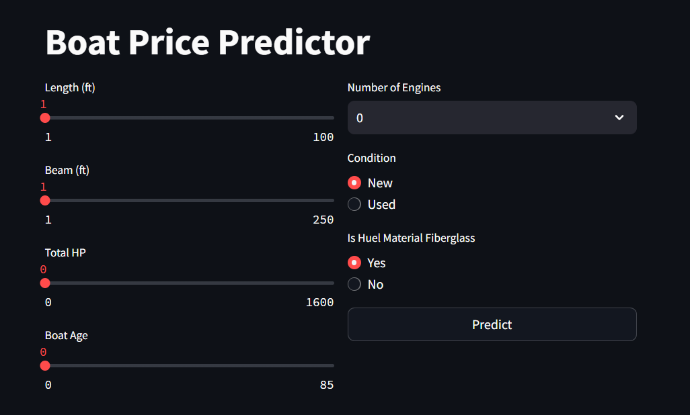
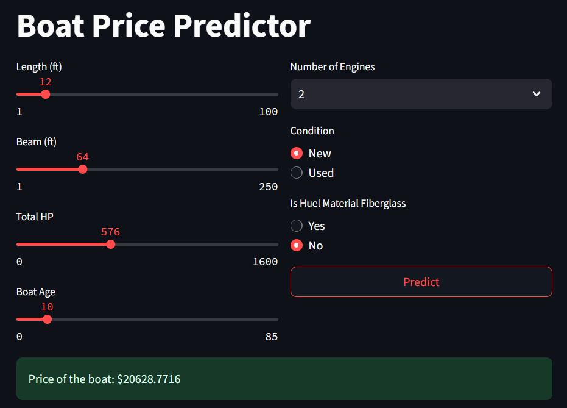

# Boat Price Predictor Dockerized Streamlit App

Solving boat price regression problem using LightGBM, integrating the model to Streamlit App, containerizing it with Docker and deploying it to an AWS EC2 instance.

## Table of Contents
- [Dataset](#dataset)
- [Project Structure](#project-structure)
- [Used Libraries&Technologies](#used-librariestechnologies)
- [Usage](#usage)
- [Screenshoots](#screenshoots)

## Dataset
The dataset `data.csv` used for this project was taken from kaggle. If you want to get more details about the dataset, you can check [this link](https://www.kaggle.com/datasets/mexwell/boat-price-prediction/data).

## Project Structure

    - utils
    |-- __init__.py
    |-- data_prep.py
    |-- eda.py
    |-- feat_eng.py
    - Dockerfile
    - app.py
    - data.csv
    - model.pkl
    - notebook.ipynb
    - requirements.txt

## Used Libraries&Technologies
| <!-- -->              | <!-- -->                       |
|-----------------------|--------------------------------|
| Data Manipulation     | NumPy, Pandas                  |
| Data Visualization    | Matplotlib, Seaborn, Missingno |
| Model&Evaluation      | Scikit-Learn, LightGBM         |
| Hyperparameter Tuning | Optuna                         |
| Web Framework         | Streamlit                      |
| Containerization      | Docker                         |
| Deployment            | AWS EC2                        |

## Usage
You can start to use the app from your browser:

    54.175.231.105:8000

### Screenshoots

